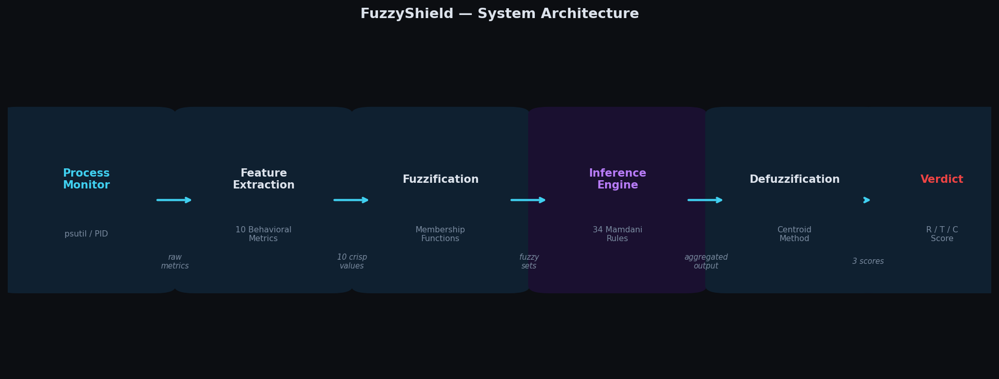
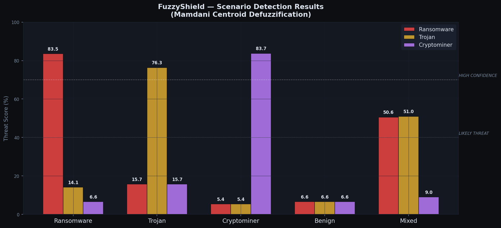
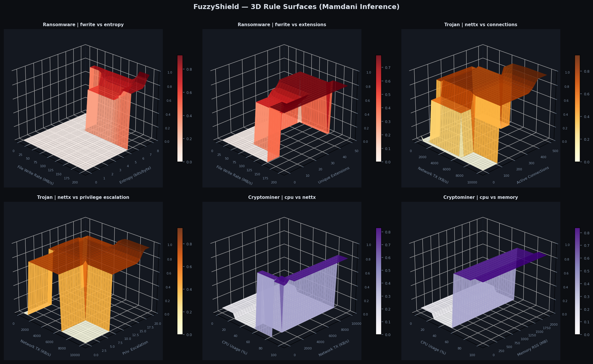

# FuzzyShield — Behavioral Malware Classifier

A fuzzy-logic-based behavioral malware classifier that scores running processes
against three threat profiles — **ransomware**, **trojan**, and **cryptominer** —
using a Mamdani fuzzy inference system with 34 rules over 10 behavioral inputs.

The project ships two mirror implementations:

| Implementation | Location | Stack |
|---|---|---|
| Python | `fuzzy_shield.py` | [scikit-fuzzy](https://github.com/scikit-fuzzy/scikit-fuzzy) |
| MATLAB | `matlab/fuzzy_shield.m` + `matlab/FuzzyShield.fis` | Fuzzy Logic Toolbox |

Both share the exact same universes, membership functions, and rule base, so
results are directly comparable.



---

## How it works

1. **Inputs (10 antecedents)** — behavioral metrics sampled from a process:

   | Variable | Meaning | Range |
   |---|---|---|
   | `cpu` | CPU usage | 0–100 % |
   | `mem` | Memory RSS | 0–2048 MB |
   | `fwrite` | File write rate | 0–200 MB/s |
   | `file_read` | File read rate | 0–200 MB/s |
   | `nettx` | Network upload | 0–10000 KB/s |
   | `netrx` | Network download | 0–10000 KB/s |
   | `ext` | Unique file extensions touched | 0–50 |
   | `conn` | Active network connections | 0–500 |
   | `ent` | Output entropy | 0–8 bits/byte |
   | `priv` | Privilege-escalation attempts | 0–20 |

   Each input has 5 linguistic terms (e.g. `idle / low / moderate / high / extreme`)
   defined with trapezoidal and triangular membership functions.

2. **Rule base (34 rules)** — hand-crafted Mamdani rules encoding threat
   fingerprints, e.g.:
   - *ransomware*: `fwrite=extreme ∧ ext=many ∧ ent=max → critical`
   - *trojan*: `nettx=flood ∧ conn=swarm → critical`
   - *cryptominer*: `cpu=extreme ∧ fwrite=none ∧ conn=few ∧ ent=ordered → critical`

3. **Outputs (3 consequents)** — independent probability scores in [0, 1] for
   each threat class, defuzzified with the centroid method.

4. **Verdict** — the max score maps to `BENIGN / SUSPICIOUS / LIKELY THREAT /
   HIGH CONFIDENCE`; near-ties produce compound labels such as
   `RANSOMWARE + TROJAN`.

5. **Temporal feedback (EWMA)** — during live monitoring an asymmetric
   exponential moving average (fast rise α=0.15, slow decay α=0.85) prevents
   burst-pause malware from resetting the alarm between activity windows.



---

## Repository layout

```
fuzzy_shield.py        Fuzzy inference engine + CLI (Python)
sim/malware_sim.py     Safe malware behavior simulator (live demo)
matlab/
  fuzzy_shield.m       MATLAB mirror of the full system
  FuzzyShield.fis      Exported FIS — open in Fuzzy Logic Designer
figures/               Pre-generated figures (architecture, MFs, surfaces, …)
referance_values.txt   Input vectors used for the 3D rule-surface plots
requirements.txt       Python dependencies
report/
  main.tex / main.pdf            IEEE conference paper (full project report)
  presentation.tex / .pdf        Beamer slides (16:9)
  generate_figures.py            Regenerates the report figures
```

Runs create an `output/` directory (git-ignored):

```
output/
├── scenarios/      preset / custom scenario runs
├── pid_sessions/   one timestamped folder per live monitoring session
└── analysis/       3D rule surfaces and standalone analysis
```

---

## Quick start (Python)

Requires Python 3.10+.

```bash
python -m venv env-fuzzy
source env-fuzzy/bin/activate
pip install -r requirements.txt
```

### Run preset scenarios

```bash
python fuzzy_shield.py                       # interactive mode
python fuzzy_shield.py --scenario ransomware # one preset scenario
python fuzzy_shield.py --all                 # all preset scenarios
python fuzzy_shield.py --report              # all scenarios + 3D surfaces
```

Presets: `ransomware`, `trojan`, `cryptominer`, `benign`, and `mixed`
(randomized ambiguous profile, different dominant threat each run).

Each run prints a colored terminal report (inputs, membership activations,
threat scores, verdict, recommendations) and saves two figures per scenario:
membership-function plots and a results dashboard.

### Live process monitoring

```bash
python fuzzy_shield.py --pid <PID>                          # defaults
python fuzzy_shield.py --pid <PID> --interval 5 --checks 12 # 12 checks, 5 s apart
```

Samples the process with `psutil` every interval, runs inference per window,
applies EWMA feedback, and saves per-check figures plus a time-series plot of
score evolution in `output/pid_sessions/`.

### Demo with the malware simulator

The simulator mimics malware *behavior patterns* (resource usage only — it
writes exclusively to `/tmp/fuzzysim_*` and uses loopback networking; no system
files or external hosts are touched).

```bash
# Terminal 1 — start a simulated threat (prints its PID)
python sim/malware_sim.py --type ransomware --duration 120

# Terminal 2 — classify it live
python fuzzy_shield.py --pid <PID> --interval 5 --checks 12
```

Steady-state types: `ransomware`, `trojan`, `cryptominer`, `benign`.
Burst-pause types (for testing EWMA evasion resistance): `ransomware_burst`,
`trojan_beacon`, `cryptominer_throttle`, `mixed_burst`.

---

## Quick start (MATLAB)

Requires the **Fuzzy Logic Toolbox**.

```matlab
cd matlab
fuzzy_shield                  % default: all scenarios
fuzzy_shield('ransomware')    % single scenario
fuzzy_shield('all')           % all scenarios + save FuzzyShield.fis
```

Generates membership-function plots, a results dashboard per scenario, and 3D
rule surfaces. The exported `FuzzyShield.fis` can be inspected interactively:

```matlab
fuzzyLogicDesigner('FuzzyShield.fis')
```

`referance_values.txt` documents the fixed input vectors used for each of the
six rule-surface plots (input order: `[cpu mem fwrite file_read nettx netrx
ext conn ent priv]`, `NaN` = swept axis).



---

## Interpreting the scores

| Max score | Verdict |
|---|---|
| < 10 % | `BENIGN` |
| 10–40 % | `SUSPICIOUS` (inconclusive) |
| 40–70 % | `LIKELY THREAT` |
| ≥ 70 % | `HIGH CONFIDENCE` |

Scores within 5 percentage points of the leader (and ≥ 35 %) are reported
together as a compound verdict, e.g. `RANSOMWARE + TROJAN`.

---

## Disclaimer

This is an academic / educational project. The "malware simulator" only
imitates resource-usage patterns (CPU load, file writes to `/tmp`, loopback
traffic) and contains no harmful functionality. The classifier is a
demonstration of fuzzy inference on behavioral telemetry, not a production
security product.
